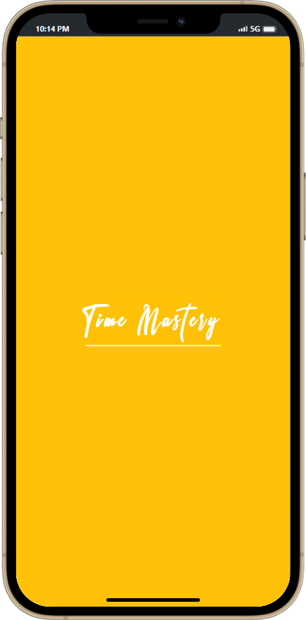
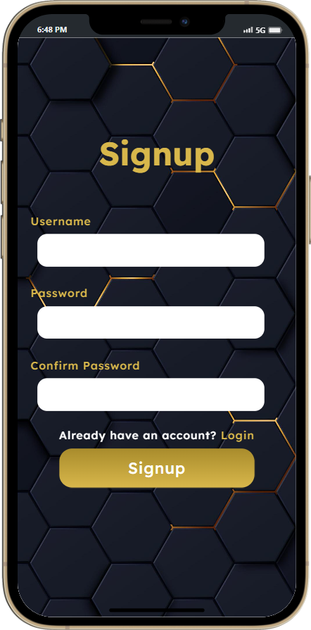
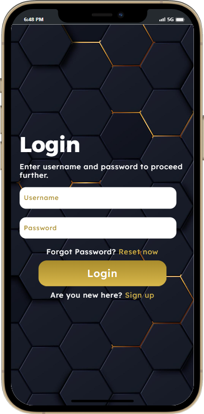
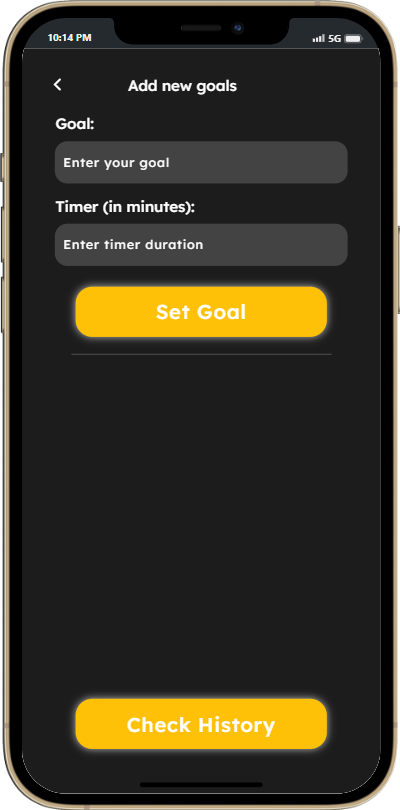
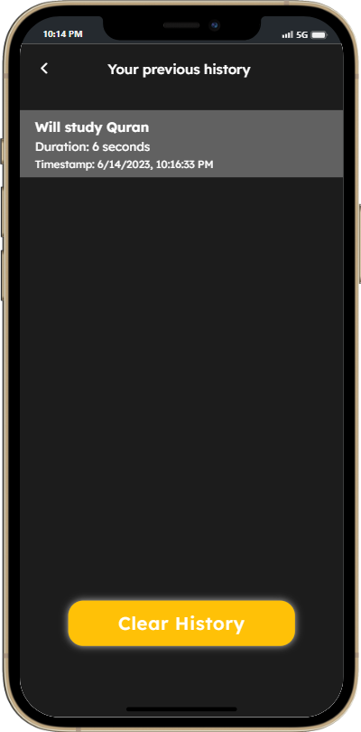
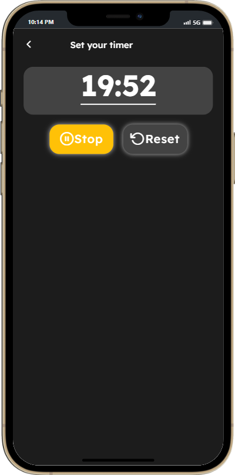

# React Native Projects

Welcome to my repository of React Native projects. This collection includes a variety of applications showcasing different aspects of React Native development, from basic UI components to complex features like Firebase authentication and state management with Redux.

## Table of Contents

- [Projects](#projects)
  - [BakingApp](#bakingapp)
  - [Calculator_app](#calculator_app)
  - [NikeApp](#nikeapp)
  - [UI's](#uis)
  - [firebaseAuth](#firebaseauth)
  - [sp21-bcs-037_LAB_TERMINAL](#sp21-bcs-037_lab_terminal)
- [Screenshots](#screenshots)
- [Installation](#installation)
- [Usage](#usage)
- [Project Structure](#project-structure)
- [Libraries and Dependencies](#libraries-and-dependencies)

## Projects

### BakingApp
A user-friendly app designed for baking enthusiasts. It features:
- **Welcome Screen**: An inviting start screen.
- **Home Screen**: Categories of baking recipes.
- **Items Screen**: Detailed list of items under each category.

### Calculator_app
A comprehensive calculator app with multiple functionalities:
- **Basic Calculator**: Standard arithmetic operations.
- **Scientific Calculator**: Advanced mathematical functions.
- **BMI Calculator**: Calculate Body Mass Index.
- **Loan Calculator**: Compute loan repayments.

### NikeApp
An e-commerce app prototype for Nike products:
- **Product Listings**: Display various Nike products.
- **Product Details**: Detailed information about each product.
- **Cart Management**: Add and manage products in the cart.
- Uses `react-redux` for state management.

### UI's
A collection of various UI components and layouts created for practice:
- **Button Styles**: Different button designs and functionalities.
- **Form Elements**: Input fields, checkboxes, and radio buttons.
- **Layouts**: Various screen layouts and navigation patterns.

### firebaseAuth
A project demonstrating Firebase authentication in React Native:
- **Sign-Up and Sign-In**: User authentication using Firebase.
- **Persistent Authentication**: Maintain user session using AsyncStorage.
- **Navigation**: Handle navigation flows based on authentication state.

### sp21-bcs-037_LAB_TERMINAL
A project developed for a lab terminal assignment:
- **Features**: Showcases various React Native capabilities.
- **UI Design**: Focus on creating an engaging and intuitive user interface.
- **Functionality**: Implements practical features as per assignment requirements.

## Screenshots

### BakingApp

.png)
.png)

### Calculator_app


### NikeApp


### UI's
.png)
.png)

### firebaseAuth


### sp21-bcs-037_LAB_TERMINAL







## Libraries and Dependencies
Below are the major libraries and dependencies used across different projects in this repository:

- `redux`: For state management.
- `react-redux`: Official React bindings for Redux.
- `react-native-firebase`: For authentication and database services.
- `@react-navigation/native`: For handling navigation between screens.
- `@react-native-async-storage/async-storage`: For persistent storage.

You can find the complete list of dependencies in the `package.json` file of each project.

## Installation

To run these projects locally, follow these steps:

1. **Clone the repository**:
    ```sh
    git clone https://github.com/Syed-Abdullah123/React-Native-Projects.git
    ```
2. **Navigate to the project directory**:
    ```sh
    cd React-Native-Projects
    ```
3. **Install dependencies**:
    ```sh
    npm install
    ```

## Usage

To run a specific project, navigate to its directory and start the React Native development server:

```sh
cd <project-name>
npm start
